**NUS ORBITAL 2026**

# **ActiveSense**

Milestone III Final Technical README

**Project ID:** 6899 **Level of Achievement:** Project Gemini

**Team members:** Tan Yi Xun and Chan Yi Long

Implementation snapshot: 26 July 2026

# **Executive Summary**

ActiveSense is a cross-platform fitness coaching application that helps
people exercise at home with clearer guidance and less concern about
camera privacy. It brings together health-aware onboarding, a basic
profile-ranked home workout suggestion, real-time pose tracking,
exercise-specific feedback, repetition counting, spoken cues, health
points, streaks, achievements, reward redemption, and a customisable 3D
avatar.

The application is built with React Native and Expo for web, iOS, and
Android. MediaPipe Tasks Vision extracts 33 pose landmarks from the live
camera feed. ActiveSense processes those landmarks on the user\'s device
using visibility checks, joint-angle rules, a lightweight pose
classifier, and a repetition state machine. Supabase Authentication
(Auth) and PostgreSQL provide the backend. The database stores profile
information and workout results, such as completed repetitions, points,
and form scores. Raw workout video is not stored.

The following sections explain what was built, how the main components
work together, how the implementation was tested, and where the current
limitations remain. Completed features are separated from deferred work
so that the final product can be assessed against the original proposal.

# **Contents**

1.  Motivation, Aim, and Vision

2.  Target Users and User Stories

3.  Final Scope and Milestone Evolution

4.  Final Feature Status

5.  System Architecture

6.  User Journey and Interface

7.  Real-Time Pose Coaching

8.  Basic Profile Ranking and Healthy-Ageing Support

9.  Health Points, Progress, and Rewards

10. Privacy-Centric 3D Avatar

11. Backend and Data Model

12. Privacy, Security, and Ethical Considerations

13. Software Engineering Practices

14. Testing and Quality Assurance

15. User Testing and Evaluation

16. Challenges and Solutions

17. Known Limitations

18. Deployment and Local Setup

19. Team Contributions and Project Timeline

20. Conclusion and Future Work

21. References

# **1. Motivation, Aim**, **and Vision**

## **Motivation**

Singapore is becoming a super-aged society. Although national programmes
encourage healthier lifestyles, knowledge alone does not always become a
sustainable habit. Time, motivation, and fear of falling remain
significant barriers. Kerk (2023) reported that time and a lack of
motivation or energy are major barriers to regular exercise among
Singapore workers. The National University of Singapore (NUS) Yong Loo
Lin School of Medicine (2020) also reported a high prevalence of fear of
falling among older adults, with activity restriction associated with
frailty and sarcopenia.

Existing fitness applications commonly track completed activity but may
not provide immediate form guidance or may expect the user to upload or
watch their own camera feed. ActiveSense explores a different approach:
short, equipment-light workouts with on-device posture analysis,
actionable feedback, Profile-ranked Home suggestions, and rewards that
make consistency visible.

## **Aim**

ActiveSense helps users exercise more confidently at home by combining
accessible workout guidance, real-time visual and spoken feedback,
profile-ranked routine selection, and habit-forming rewards in one
cross-platform application.

## **Vision**

Our vision is a privacy-conscious coaching companion that supports both
younger users with limited time and older users seeking lower-impact
movement. ActiveSense is not a medical device and does not replace
professional diagnosis, physiotherapy, or supervision. Its feedback is
intended as general exercise guidance.

# **2. Target Users and User Stories**

1.  **Busy student:** As a student without a gym membership, I want
    equipment-light workouts and immediate form cues so that I can
    exercise efficiently in a small space.

2.  **Older adult:** As an older adult with limited mobility, I want
    low-impact routines and clear positioning guidance so that I can
    follow an appropriate session at home.

3.  **Motivation-focused user:** As a user who struggles with
    consistency, I want points, streaks, progress charts, and
    achievements so that completed activity feels rewarding.

4.  **Privacy-conscious user:** As a user concerned about camera
    privacy, I want pose processing to occur locally and an
    avatar-oriented workout view so that raw video does not need to be
    stored remotely.

5.  **Returning user:** As a returning user, I want my profile, workout
    history, points and redeemed rewards to persist so that I can
    continue where I left off.

# **3. Final Scope and Milestone Evolution**

  **Stage**     **Primary objective**                                                                **Delivered evidence**
  ------------- ------------------------------------------------------------------------------------ ----------------------------------------------------------------------------------------------------------------------------------------------------------------------------------------------------------------------------------------------------------------------------------------------------------------------------------------------------
  Proposal      Define privacy-conscious fitness coaching, age-tailored exercise and Healthpoints.   User stories, feature scope, and technology research.
  Milestone 1   Establish technical feasibility.                                                     MediaPipe landmark proof of concept, initial repetition counting, application scaffold, and avatar research.
  Milestone 2   Produce a navigable working prototype.                                               Authentication and onboarding flows, workout screens, squat tracking prototype, early Supabase integration, and avatar customisation.
  Milestone 3   Integrate the product across platforms and strengthen engineering quality.           Shared workout experience, nine supported pose-rule categories, spoken cues, scoring, spendable and lifetime Healthpoints, transactional workout and reward persistence, scannable reward coupons, achievements, Row Level Security (RLS), platform-specific camera and avatar rendering, daily and weekly activity views, and documented testing.

# **4. Final Feature Status**

  **Feature**                                  **Status**                   **Final implementation**                                                                                                                                                                                         **Remaining limitation**
  -------------------------------------------- ---------------------------- ---------------------------------------------------------------------------------------------------------------------------------------------------------------------------------------------------------------- -----------------------------------------------------------------------------------------------------------------------------------------
  Authentication                               **Completed**                Email/password sign-up and login through Supabase Authentication (Auth) with persistent sessions.                                                                                                                Email confirmation and production recovery flows require final deployment configuration.
  Health-aware onboarding                      **Completed**                Collects name, age, fitness level, preferred intensity, medical considerations, and avatar configuration.                                                                                                        Age, fitness level, and intensity support recommendations. Medical answers are currently stored and displayed only.
  Workout library                              **Completed**                Searchable and filterable catalogue with three seeded workout groups, nine supported pose-rule keys, difficulty, duration, calories, and ordered exercise steps.                                                 Catalogue scope is limited to movements supported by both the pose rules and the 3D avatar.
  Profile-ranked Home suggestion               **Completed**                Sorts active workouts with fixed weights for exact difficulty and intensity matches, plus age-metadata weighting.                                                                                                A rule-based rather than a learned recommendation model.
  Pose landmark detection                      **Completed**                MediaPipe Tasks Vision or platform-specific camera views provide 33-point landmark frames.                                                                                                                       Accuracy depends on lighting, visibility, camera position, and hardware.
  Form feedback and rep counting               **Completed**                Exercise-specific posture rules, classifier fallback, dynamic top/bottom transitions, static-hold stability gates, and spoken cues.                                                                              Heuristics are not clinically validated.
  Healthpoints and progress                    **Completed**                Separates the spendable balance from lifetime points earned, while retaining streaks, total workouts, weekly Home activity, daily Progress activity, achievements, and transactional session completion.         Healthpoints are a prototype currency and are not linked to external health programmes.
  Reward redemption                            **Completed**                Atomic redemption prevents overspending and duplicate claims. A redeemed item can be reopened as a coupon with a unique Code 128 barcode, Ready or Used status, and recorded usage details.                      Displayed vouchers and merchant scanning are prototype demonstrations; no commercial partnerships are implied.
  3D avatar customisation                      **Completed / integrated**   binary 3D model (GLB) assets, creator bridge, platform-specific rendering, and avatar-led workout presentation.                                                                                                  Remote creator availability and device graphics processing unit (GPU) capability can affect the experience.
  Fitness Companion                            **Completed**                Avatar customisation, GLB rendering, and progress presentations are implemented. Present growth stages would change over time based on the increase in health points and would evolve into 5 different stages.   Existing evolution may not be able to keep up with avid users who may reach the final evolution phase very quickly
  Recommendation of workouts                   **Completed**                Recommended tab created for recommended exercises and labels to indicate highlighted suitability for every exercise                                                                                              May not be able to provide perfect recommendations, as they are based on scoring various health indicators provided in the user profile
  Social leaderboard and seasonal challenges   **Deferred**                 Not part of the final core implementation.                                                                                                                                                                       Requires moderation, anti-cheat, and additional backend work.
  Clinical validation                          **Out of scope**             Safety-oriented messaging and health-profile fields are present.                                                                                                                                                 No claim of diagnosis, treatment, or injury prevention is made.

# **5. System Architecture**

ActiveSense follows a layered architecture. React Native screens utilise
a database facade and storage services, rather than directly coupling
user interface (UI) code to Supabase queries. Platform-specific files
isolate differences in camera, WebView, GLB, and pose-rendering
behaviour while sharing navigation, workout state, scoring, and
persistence logic.

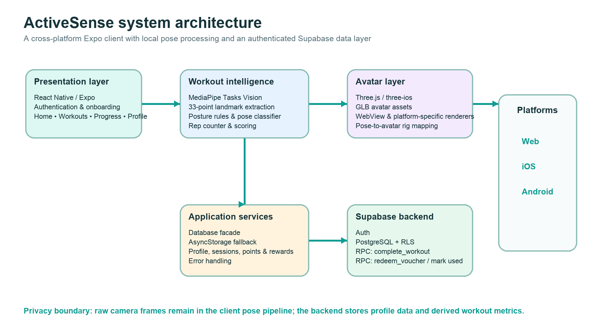

*Figure 1. ActiveSense system architecture and privacy boundary.*

## **Architectural layers**

-   **Presentation:** authentication, onboarding, Home, Workouts,
    Progress, Profile, and full-screen workout sessions, fitness
    companion.

-   **Workout intelligence:** MediaPipe landmarks, visibility
    validation, posture rules, pose classification, repetition state,
    recommendation of exercises, and scoring.

-   **Avatar rendering:** Three.js/three-ios, GLB assets, WebViews, and
    pose-to-avatar rig transformations.

-   **Application services:** database facade, user-profile storage,
    session persistence, points, achievements, fallback behaviour,
    account settings, notifications, help, and support.

-   **Backend:** Supabase Authentication (Auth), PostgreSQL, RLS,
    triggers, indexes, and transactional remote procedure call (RPC)
    functions for workout completion, voucher redemption, and marking
    a coupon as used.

# **6. User Journey and Interface**

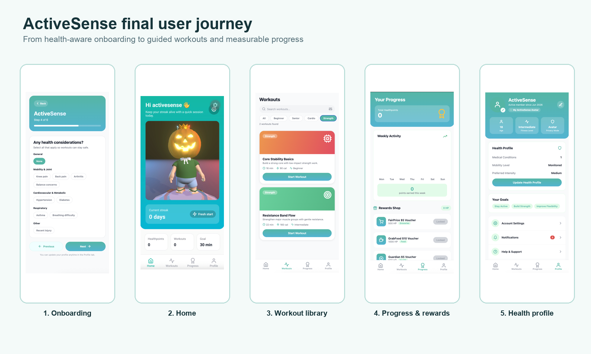

*Figure 2. Final user journey: onboarding, Home, workout discovery,
progress, and health profile.*

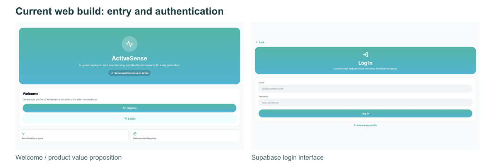

*Figure 3. Screenshots captured from the current ActiveSense web build:
product entry and Supabase authentication.*

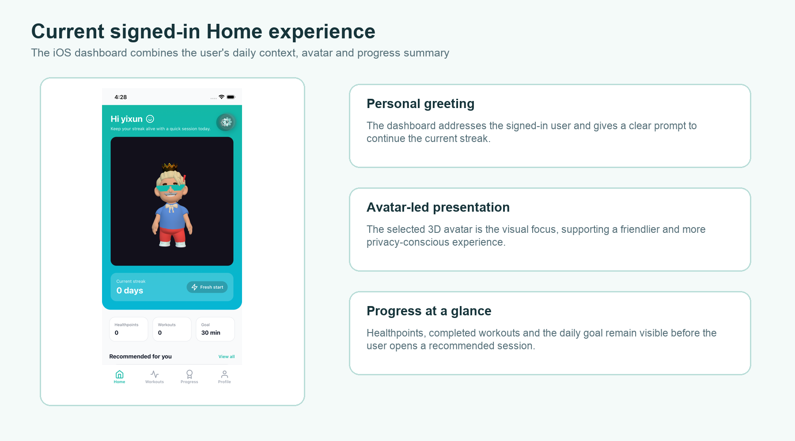

*Figure 4. Signed-in Home dashboard captured from the current iOS
development build.*

1.  A new user creates an account and completes the health-aware
    onboarding sequence.

2.  The Home screen loads profile information, current streak, health
    points, total workouts, weekly activity, and one profile-ranked
    workout suggestion.

3.  The Workouts screen presents catalogue filters and launches a
    full-screen camera-led session.

4.  The session produces immediate visual and spoken feedback, counts
    valid movement cycles, and calculates earned points.

5.  After completion, the derived results update both the spendable and
    lifetime health points totals. Lifetime points remain available
    for achievement checks even after the current balance is spent.

6.  A redeemed reward changes from **Redeem** to **Open**. The user can
    reopen the unique coupon barcode and view whether it is ready or
    already used.

7.  The Profile screen allows the user to review health considerations,
    the current privacy label, goals, and avatar configuration. The
    saved privacy label defaults to Avatar; camera and avatar
    presentation can be toggled during a workout.

# **7. Real-Time Pose Coaching**

The pose pipeline is intentionally lightweight and interpretable. PR
\#14 adjusted visibility and movement thresholds for the range supported
by the 3D avatar. MediaPipe returns 33 normalised landmarks. ActiveSense
rejects frames when required joints have low visibility, derives joint
angles and relative distances, and then evaluates exercise-specific
rules. Eight active movement classes require a bottom-to-top cycle
before one repetition is counted. Single Leg Stand requires a stable,
warning-free posture before time-based progress is awarded. PR \#15
aligns the active catalogue, fallback data, database seed, icons and
verifier with the nine supported pose-rule keys. Strength Form Basics
contains Squats at 3 sets of 10 for 50 points, Sit to Stand at 3 sets of
10 for 40 points, and Calf Raises at 3 sets of 12 for 35 points. Healthy
Ageing Balance & Strength contains Stationary March at 2 sets of 20 for
30 points, Side Leg Raise at 2 sets of 10 for 35 points, Single Leg
Stand at 2 sets of 5 for 35 points, Sit to Stand at 2 sets of 10 for 35
points, and Calf Raises at 2 sets of 12 for 30 points. Mobility &
Flexibility contains Overhead Reach, Side Bend and Torso Twist, each at
2 sets of 10 for 25 points.

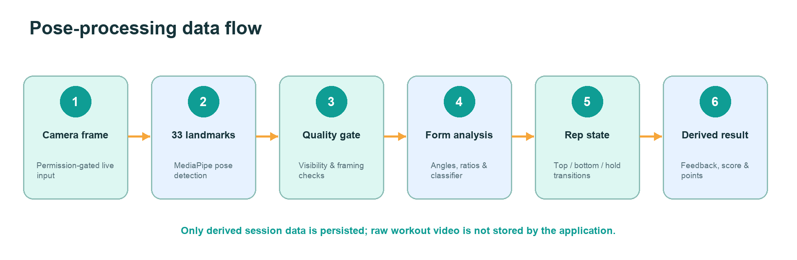

*Figure 5. Local pose-processing and derived-data flow.*

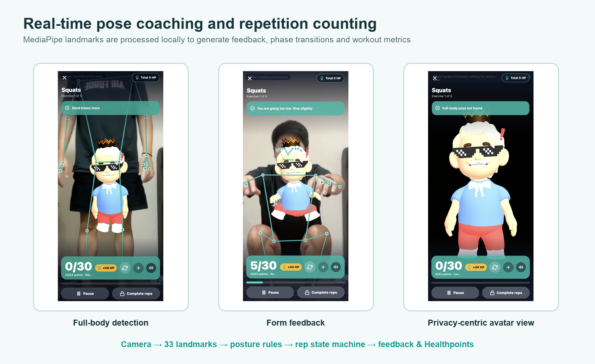

*Figure 6. Captured full-body detection, feedback, and avatar-oriented
workout views.*

## **Current pose-rule catalogue and scope**

  **Movement**       **Primary signals**                                                          **Example feedback**
  ------------------ ---------------------------------------------------------------------------- --------------------------------------------------------------------------------------------------------------------------------------------------------------------------------------------------------
  Squat              Knee and hip angles, torso angle, stance width, and hip depth.               Chest up, knees aligned, lower with control.
  Calf Raise         Vertical heel movement relative to the ankle and upright body alignment.     Rise onto the toes with control and lower the heels gently.
  Torso Twist        Shoulder-to-hip width ratio, and depth difference during rotation.           Rotate through the torso with control; return to centre.
  Sit-to-stand       Hip and knee angles with full-body/chair framing.                            Keep your chair and full body in frame.
  Overhead reach     Wrist height relative to the shoulders and upright body alignment.           Reach both arms overhead; lower them with control.
  Side leg raise     Torso stability and lateral leg position.                                    Keep hips level; raise them with control.
  Single-leg stand   Upright torso, ankle/knee positions, and balance hold.                       Stand tall and use support if needed.
  March              Alternating knee height and upright posture.                                 Good knee lift; keep marching gently.
  Side Bend          Shoulder-line tilt while the hips and stance remain controlled.              Bend to the side with control; return to centre.
  Catalogue Status   Nine active pose-rule keys are used across the three final workout groups.   Push-up, Lunge, Hip Extension, Quadriceps Stretch and Triceps Stretch are not part of the active PR \#15 catalogue because they are not supported by the final production rule and avatar combination.

## **Joint-angle and visibility checks**

Posture rules use joint angles only when the required landmarks are
visible. This prevents a missing wrist, ankle, or shoulder from being
treated as a valid movement measurement.

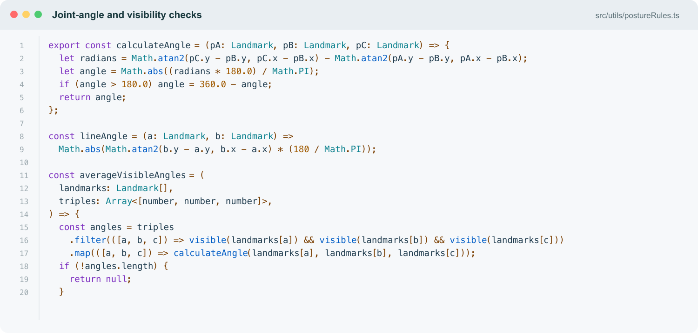

*Figure 7. Joint-angle calculation and landmark visibility checks in
src/utils/postureRules.ts.*

## **Repetition-counting safeguards**

Dynamic movements and static holds use different counting rules. A
static hold must remain stable for 1.8 seconds, while a dynamic
repetition must move from the bottom position back to the top. Both
paths include timing guards and a target-repetition cap.

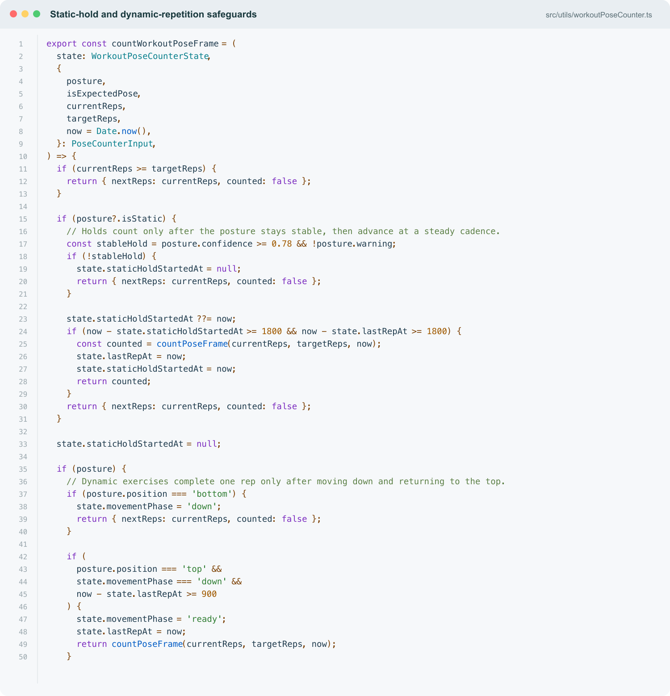

*Figure 8. Static-hold and dynamic-repetition state handling in
src/utils/workoutPoseCounter.ts.*

-   A dynamic repetition is only counted after the user moves to the
    recognised bottom state and returns to the top state.

-   A 900 ms debounce prevents rapid duplicate counts.

-   Static holds require confidence of at least 0.78, no active warning,
    and 1.8 seconds of stability.

-   Repetitions are capped at the configured target.

-   When landmarks are missing, the user receives a framing instruction
    rather than an inferred result.

-   Spoken feedback is rate-limited, so cues do not overlap
    continuously.

## **Scoring**

Each exercise has configured base points and target repetitions. Points
are proportional to the completion ratio. Movements completed faster
than the expected two seconds per repetition are flagged as rushed and
receive a 50% point reduction. This discourages users from rapidly
triggering the counter without controlled movement.

# **8.** Recommendation of exercises based on Profile Ranking, and Healthy-Ageing Support

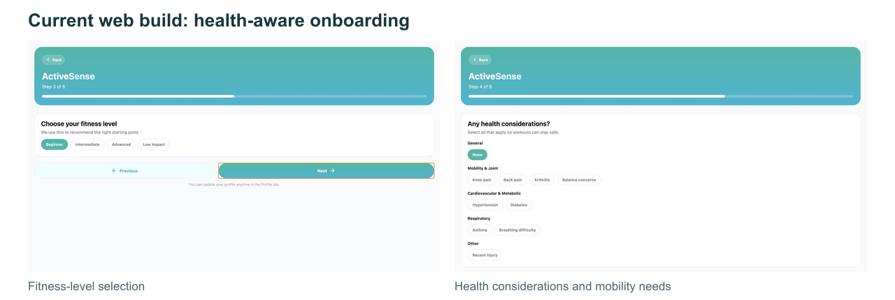

*Figure 9. Screenshots captured from the current ActiveSense web build:
fitness-level selection and health-consideration onboarding.*

Onboarding collects age, fitness level, preferred intensity, and
selected medical considerations. Workouts are evaluated on a normalized
100-point scale, awarding +45 points for an exact fitness level match,
+35 points for an intensity match, and +20 points for passing health
safety checks (or having no restrictions). To prioritize safety, any
user with knee or joint issues selecting a High-Impact or HIIT workout
incurs a -100 point penalty, instantly disqualifying the workout to 0
points. For the \"For You\" tab, workouts are sorted in descending
order, strictly taking the top 3 highest-scoring workouts that meet an
80+ point threshold (requiring both level and intensity matches).
Medical-condition selections are not currently part of this ranking. The
catalogue also supports Low Impact difficulty and age metadata, although
the current code does not compare a profile age with the stored bounds.

With these profile scorings, a special "Recommended for you" tab has
been created to choose from only the top 3 suitable exercises based on
the user profile, with various messages of suitability for various
exercises.

This is a basic deterministic ranking, not a medical prescription.
Medical-condition selections are saved and displayed in the Health
Profile, but they are not currently used by the recommendation ranking.
The system does not diagnose a condition or guarantee that a routine is
safe for every user. Users should consult a qualified professional when
they have pain, balance concerns, a recent injury, or medical
restrictions.

# **9.** Health Points, **Progress**, **Rewards, and Fitness Buddy**

A completed workout produces earned points, poses landmark count, and a
derived session record. The complete_workout PostgreSQL function inserts
the session and updates the spendable Healthpoints balance, lifetime
Healthpoints, streak days, and total workouts in one transaction. A
client-generated session key makes the operation idempotent, protecting
against duplicated rewards if the completion request is retried.

The Progress screen shows the current balance separately from the
lifetime total. Redemptions reduce only the spendable balance, while
lifetime earnings remain unchanged for long-term achievements.
Achievement rules can therefore use lifetime health points, streak days,
or total workouts without being reversed when a reward is claimed.

Voucher redemption uses a row lock and an atomic server-side function to
confirm availability, check the balance, prevent duplicate redemption,
and deduct points. Each successful claim receives a unique redemption
code. The reward can then be reopened from the Progress screen as a
coupon containing a Code 128 barcode. The coupon also displays whether
it is ready to redeem or has been used, together with the recorded usage
time and merchant label when those values are available.

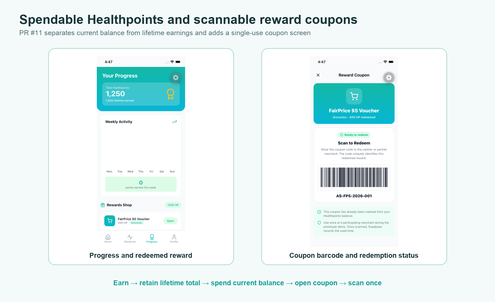

*Figure 10. Pull request (PR) \#11 reward flow captured from the iOS
development build using seeded prototype values.*

## **Transactional reward checks**

Voucher redemption runs inside PostgreSQL rather than relying on a
sequence of client-side updates. The row lock, balance check and
duplicate-redemption check are completed before the points balance is
changed. A separate authenticated mark_voucher_used function records
used_at and used_by for the merchant-scanner prototype.

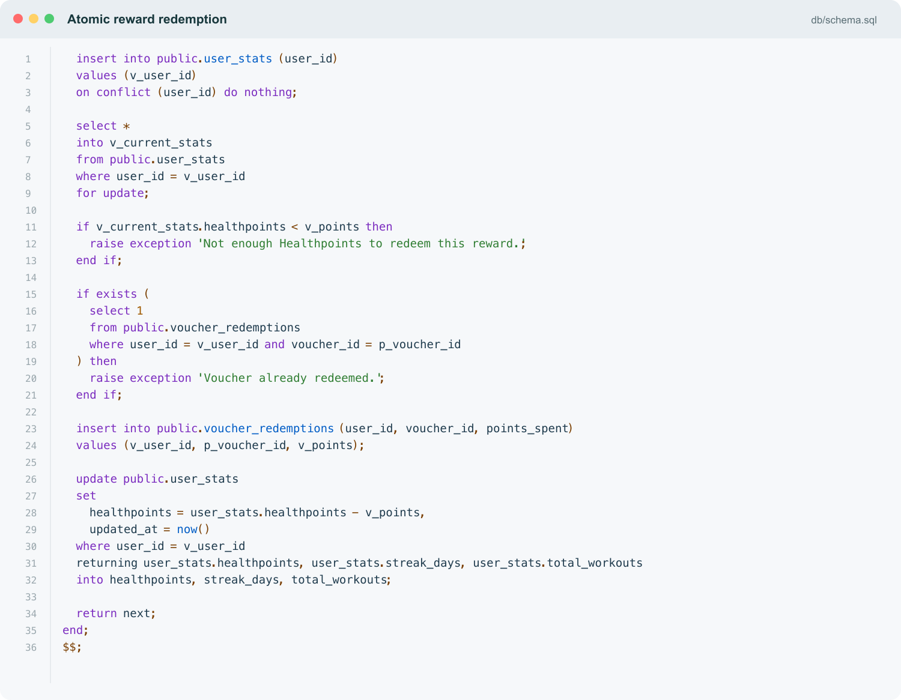

*Figure 11. Atomic voucher redemption and Healthpoints update in
db/schema.sql.*

## **Evolution of Fitness Companion based on HealthPoints**

The fitness companion has 5 different stages of evolution (Baby Goku,
Kid Goku, Adult Goku, Super Saiyan Goku, and Ultra Saiyan Goku) and
would evolve upon reaching the 200 KI power level or health points.
There are also animations and various encouraging messages displayed to
further encourage users to continue to stay fit.

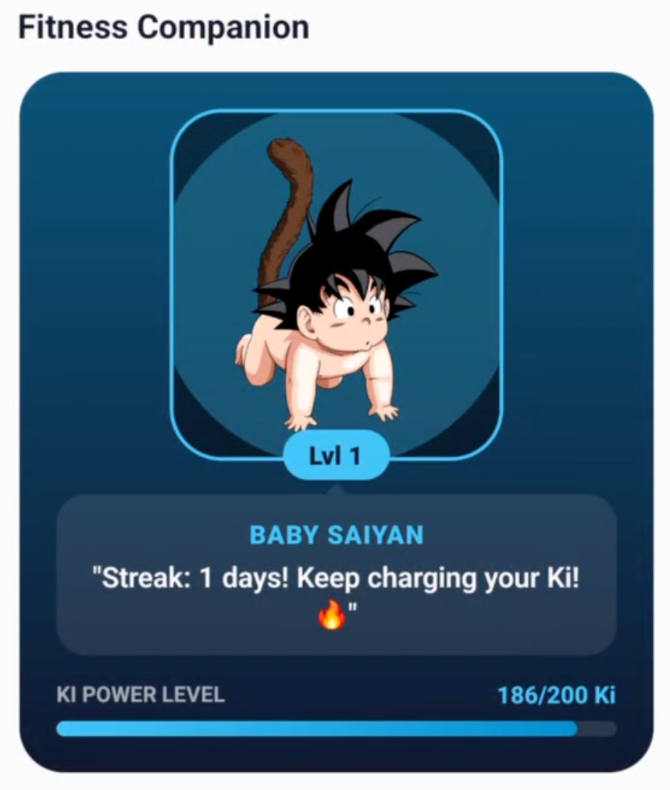
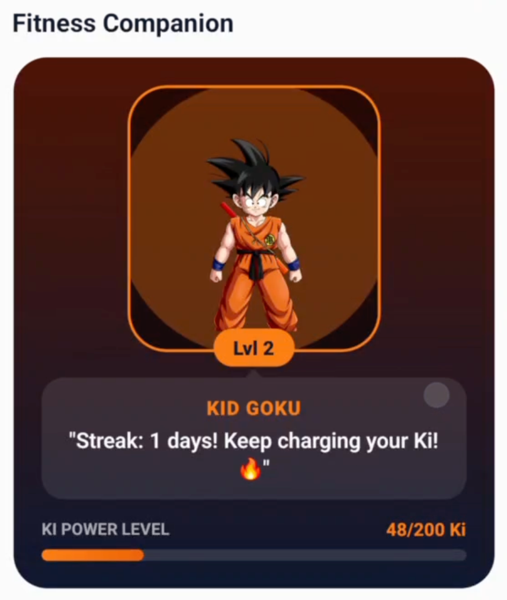
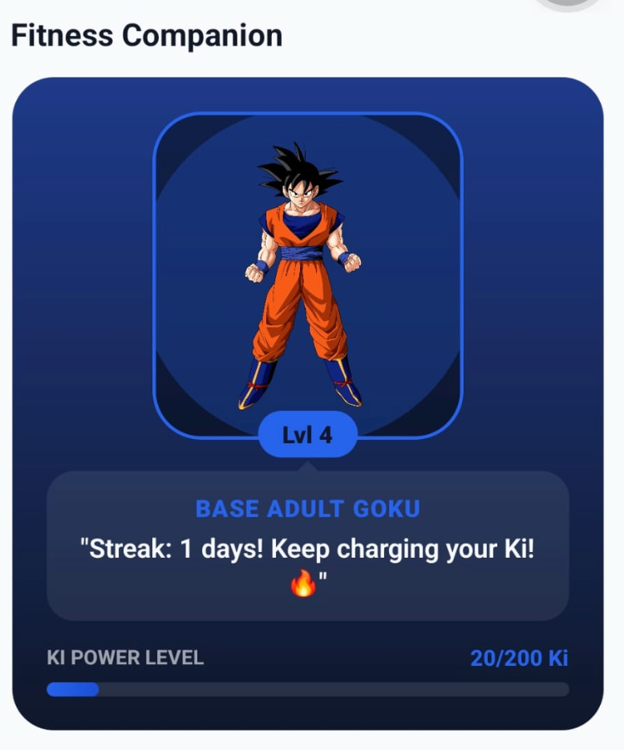

*Figure 12. Examples of the first 3 different stages of the fitness
companion*

# **10. Privacy-Centric 3D Avatar**

The avatar subsystem supports GLB assets, customisation, capture/share
flows, and a workout-oriented avatar view. Separate web, iOS, and
Android components accommodate different rendering capabilities. Pose
landmarks can be mapped to an avatar rig so that the user can focus on a
simplified body representation. The avatar view can reduce camera
anxiety while keeping the movement feedback visible.

*Figure 13. 3D Avatar Tech Stack*

The avatar website (http://activesense.dpdns.org) is
registered using Digitalplat free domain. The setup uses cloudflare
workers and pages with the registered free domain and an Azure Ubuntu VM
to host the avatar configuration and live model to be used for the app.
To use our own free database to store all the GLB avatar files created
using Blender, we installed Coolify in the Azure VM to automate and
deploy our own Pocketbase database.

Once all the resources for the 3D avatar are available, we built the
avatar website using React initialized with Vite, styled using Tailwind
CSS for responsive UI components. We used Three.js integrated through
React Three Fiber (\@react-three/fiber) for rendering the 3D scene
canvas and React Three Drei (\@react-three/drei) for helpers like camera
controls. We also used Zustand to manage global state, including active
categories, selected equipment/clothing items, skin color, and fetched
backend metadata.

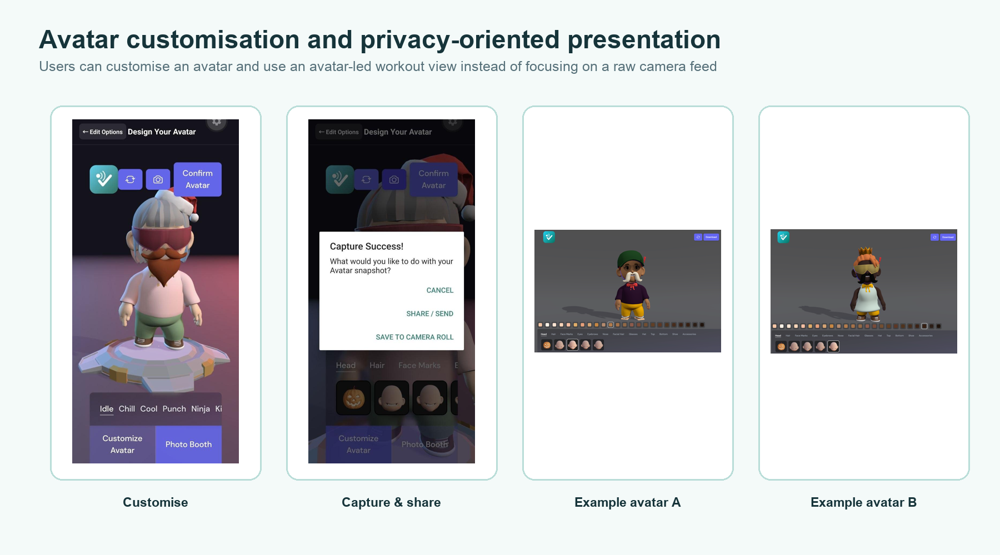

*Figure 14. Avatar customisation, capture and example configurations.
Figure 6 also shows the avatar rendered during a workout.*

Where the remote creator cannot be reached, the application provides a
default avatar instead of blocking the main workout journey. Avatar
availability is therefore treated as an enhancement rather than a
requirement for pose tracking.

# **11. Backend and Data Model**

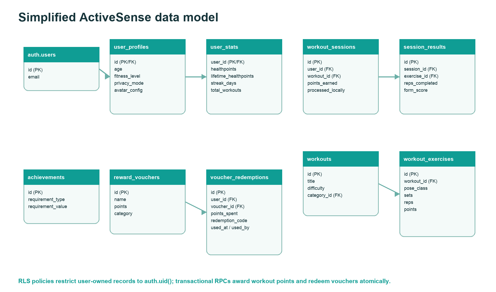

*Figure 15. Entity relationship diagram for the main Supabase/PostgreSQL
tables.*

  **Data group**                                                    **Purpose**
  ----------------------------------------------------------------- ----------------------------------------------------------------------------------------------------------------------------------------------
  exercise_types, workout_categories, workouts, workout_exercises   Three active workout groups, ordering, difficulty, age ranges, 11 ordered exercise rows and nine supported pose-rule keys.
  user_profiles and user_profile_medical_conditions                 Onboarding profile, privacy preference, avatar configuration, and normalised health considerations.
  user_stats                                                        Spendable health points, lifetime health points, streak days, total workouts, and last workout date.
  workout_sessions and workout_session_exercise_results             Derived completion history, completed reps, points, form score, and local-processing flag.
  reward_vouchers and voucher_redemptions                           Reward definitions, points expenditure, unique redemption codes, duplicate-redemption prevention, and optional used_at/used_by audit fields.
  achievements                                                      Configurable progress thresholds and unlock conditions.
  app_option_groups, app_options, app_settings and app_pages        Configurable onboarding choices, information pages, and small application settings.
  pose_training_samples                                             Ten-feature vectors used by the lightweight nearest-centroid classifier.

Database constraints prevent invalid values such as negative points or
unsupported difficulty labels. Foreign keys preserve relationships,
indexes support common history/catalogue queries, and triggers keep
updated_at values reliable.

# 12. Privacy, Security, and Ethical Considerations

-   **Local camera processing:** raw pose frames are analysed in the
    client; session persistence contains derived values rather than
    video.

-   **Permission gating:** the camera is requested only for camera-led
    workouts and the UI provides actionable permission/error messages.

-   **Authentication:** Supabase Auth manages email/password credentials
    and persistent sessions.

-   **Row Level Security:** user-owned tables use policies based on
    auth.uid().

-   **Least privilege:** the client uses the public anonymous key;
    service-role credentials must never be included in the application
    bundle.

-   **Atomic operations:** points awards, redemptions and coupon usage
    updates are performed by authenticated server-side functions.

-   **Sensitive profile data:** age supports the basic Home ranking,
    while medical considerations are currently stored for profile
    display and user context only.

-   **Medical boundary:** ActiveSense provides general exercise feedback
    and is not clinically validated as a medical device.

Before public deployment, configuration files should be audited so that
only intended public Expo values are tracked, all secrets remain in
untracked local or deployment configuration, credentials are rotated
where appropriate, and automated secret scanning is enabled.

# 13. Software Engineering Practices

The Milestone 2 poster summarised the team\'s engineering approach as
clean and maintainable code, Git and GitHub version control, and
frequent testing with iterative improvement. These themes remained in
Milestone 3 and were strengthened through clearer module boundaries,
platform-specific adapters, defensive validation, pull-request
integration, TypeScript checking, and database verification scripts.
Feedback from peer walkthroughs and issues found during device and
integration testing informed later interface and reliability
refinements.

**Component and service separation**

Navigation, screens, camera views, avatar views, database access,
storage, pose classification, posture rules, scoring, and rig mapping
are implemented in separate modules. UI screens call a database facade
rather than duplicating Supabase query logic.

## **Cross-platform file boundaries**

React Native\'s platform-specific file resolution is used for camera
previews, workout sessions, avatar showcases, and GLB rendering. Shared
business rules remain in common TypeScript files, reducing behaviour
drift between web, iOS, and Android.

## **Defensive programming**

-   Missing Supabase configuration produces a readable error or
    > controlled prototype fallback.

-   Invalid catalogue colours and incomplete database results are
    > validated before rendering.

-   Low-visibility pose landmarks are rejected instead of being guessed.

-   Workout completion is idempotent, and reward redemption is
    > transactional.

-   Remote avatar failure falls back to a default asset.

## **Version control**

The team used Git and GitHub with feature branches, pull requests, and
integration commits. Recent work includes shared workout tracking across
platforms, iOS workout-rendering fixes, Supabase-flow integration,
Android implementation, and 3D avatar improvements. PR \#11 added
lifetime health points and the reward-coupon flow, PR \#12 refreshed
progress data whenever the tab regains focus, and PR \#13 corrected the
weekly-activity query and aggregation. PR \#14 consolidated the
interface, improved avatar mapping and camera framing, relaxed pose
thresholds, and added the daily Healthpoints chart on Progress. The
merged PR \#15 aligned the workout catalogue with the nine movements
supported by the final pose rules and avatar.

# 14. Testing and Quality Assurance

## **Merged-main verification and historical test evidence**

On 26 July 2026, merged origin/main at PR \#15 passed npx tsc \--noEmit.
A read-only Supabase check also confirmed three active workout groups,
11 workout-exercise rows and nine supported pose-rule keys. Separately,
a temporary local-only harness using jest-expo and React Native Testing
Library was applied to an isolated PR \#13 snapshot. With two
testability hooks that export the barcode helper and label the coupon
close button, all 6 suites and 38 tests passed. The harness covers
workout scoring, repetition transitions, posture fallbacks, pose
classification, Code 128 encoding, reward-coupon states, and an
integrated workout pipeline. GitHub main still contains no Jest
configuration, npm test script, or committed unit-test files, so these
results are local verification evidence rather than evidence from a
repository\'s continuous integration (CI) pipeline. The repository also
contains scripts/verify-supabase.js for connected database checks.
Broader physical-device regression across different device models is
still required.

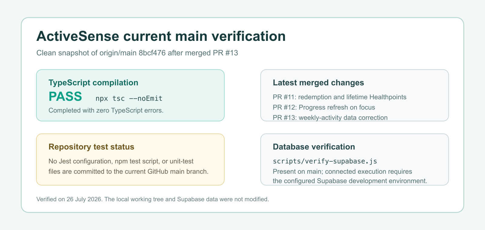

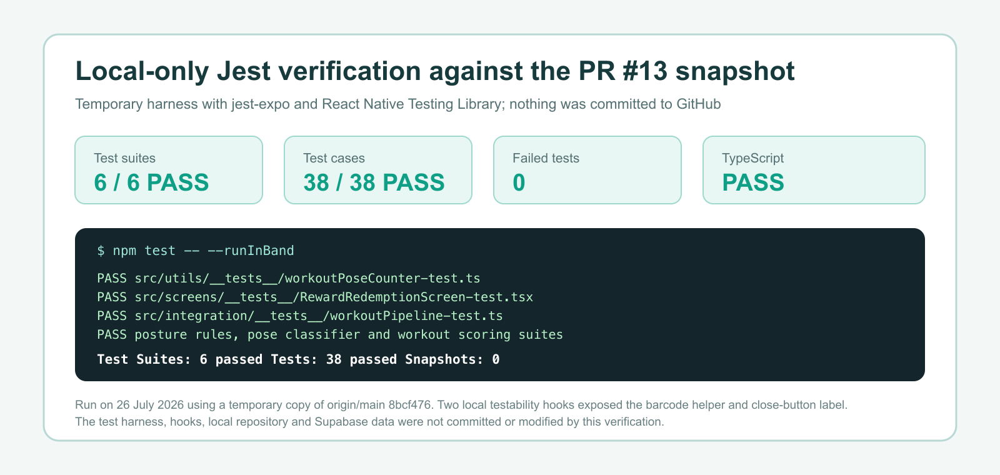

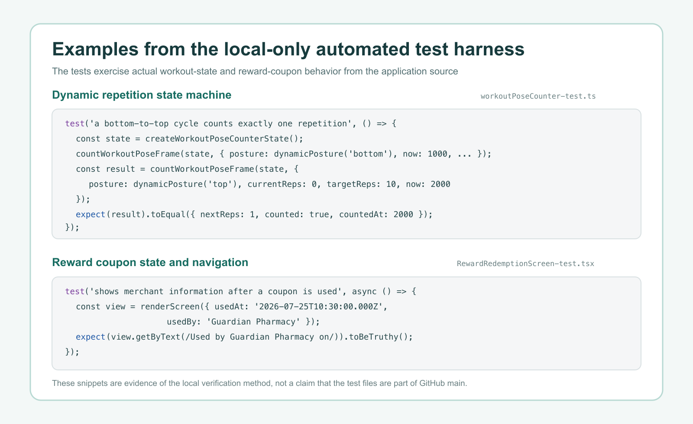

Historical PR \#11 verification: before PR
\#11 was merged, the reward-redemption work completed a connected
Supabase verifier, TypeScript checking, iOS and Android Expo exports,
and a native launch on an iPhone 16e simulator. This PR \#11 work is
historical evidence. A later PR \#13 snapshot was independently
type-checked and used for the local-only Jest harness described above.
The database verifier covered Healthy Ageing data, lifetime
Healthpoints, unique redemption codes, and the coupon usage function.
Its optional cleanup step was skipped because no service-role key was
supplied, which is expected when .env.local contains only
non-administrative development values. The first evidence panel is a
dated screenshot of the PR \#13 snapshot, while the current merged PR
\#15 verification is reported above. The remaining evidence panels and
unit-test (UT) rows document the local-only Jest run. In the identifiers
below, ST means system and tool verification, and IT means integration
test. Those test files are not committed to the main branch on GitHub.

  **ID**   **Test**                           **Expected Result**                                                                               **Result**
  -------- ---------------------------------- ------------------------------------------------------------------------------------------------- ---------------------------------------------------------------------
  UT-01    Joint-angle calculation            A right-angle landmark triplet returns 90°.                                                       **PASS**
  UT-02    Partial-completion score           5/10 repetitions of a 100-point exercise return 50 points when not rushed.                        **PASS**
  UT-03    Rushed-movement penalty            A completed but unrealistically fast set receives a 50% point reduction.                          **PASS**
  UT-04    Manual repetition cap              Adding a repetition at the target does not exceed the target.                                     **PASS**
  UT-05    Dynamic repetition state machine   A bottom state alone does not count; a subsequent top state counts exactly one repetition.        **PASS**
  UT-06    Static-hold confidence gate        A hold below 0.78 confidence does not start or advance the hold timer.                            **PASS**
  UT-07    Missing-landmark fallback          An empty landmark frame returns an unknown position and zero confidence.                          **PASS**
  ST-01    TypeScript compilation             Project type-check completes without TypeScript errors.                                           **PASS**
  ST-02    Connected database verification    Schema, seed data, lifetime points, redemption codes, and mark_voucher_used behave as expected.   **PASS**
  ST-03    iOS export and native launch       The iOS bundle exports and the development build launch on the iPhone 16e simulator.              **PASS** with duplicate-symbol linker warnings and no build errors.
  ST-04    Android export                     The Android JavaScript bundle and static assets were exported successfully.                       **PASS**

## **Implementation and regression-check matrix**

  **ID**   **Flow**                      **Acceptance criteria**                                                                                                       **Current evidence/status**
  -------- ----------------------------- ----------------------------------------------------------------------------------------------------------------------------- -----------------------------------------------------------------------------------------------------
  IT-01    Sign-up and login             A valid user receives a persistent session and reaches onboarding/Main.                                                       Implemented in the Supabase service; final deployed-environment regression required.
  IT-02    Onboarding persistence        Profile and medical selections persist and reload after navigation.                                                           Implemented in the storage service and RLS-backed tables.
  IT-03    Workout recommendation        The Home suggestion reflects exact difficulty and intensity matches, plus the current age-metadata weights.                   Rule path verified by source inspection; add deterministic automated cases.
  IT-04    Camera permission failure     User receives a clear permission message without an application crash.                                                        Error mapping implemented; physical-device regression required.
  IT-05    Squat feedback and counting   Full-body landmarks display; bottom-to-top cycle counts once; feedback updates.                                               Captured UI evidence available; repeat on final web/iOS/Android builds.
  IT-06    Workout completion            One session is inserted, and spendable/lifetime points, streaks, and workout count update exactly once.                       Transactional and idempotent RPC implemented; connected-database verifier passed.
  IT-07    Voucher redemption            A sufficient balance is deducted once, lifetime earnings remain unchanged, and low balance or duplicate claims fail safely.   Atomic RPC, unique constraint, and connected-database verifier passed.
  IT-08    Avatar service unavailable    The default avatar remains usable, and the main navigation is not blocked.                                                    Fallback UI captured and implemented.
  IT-09    Cross-platform smoke test     Authentication, workout launch, camera, completion, and persistence functions work on web, iOS, and Android.                  Platform-specific implementations exist; the final device matrix remains mandatory.
  IT-10    Coupon open and usage state   A claimed reward opens its unique barcode; the scanner RPC can record its used status, time, and merchant identifier once.    iOS UI captured; connected-database verifier passed for redemption-code and usage-state operations.

## **Remaining cross-platform device matrix**

  **Platform**   **Minimum final checks**                                                                                **Metrics to record**
  -------------- ------------------------------------------------------------------------------------------------------- -------------------------------------------------------------------------------------------
  Web            Chrome/Safari camera permission, squat tracking, responsive layout, and Supabase session persistence.   Browser version, average visual latency, and count accuracy over 20 repetitions.
  iOS            Signed dev build, native pose view, spoken cue, avatar rendering, and completion flow.                  Device and operating system, frame stability, thermal behaviour, and successful sessions.
  Android        Camera permission, native overlay, background/foreground recovery, and reward persistence.              Device and operating system, frame stability, count accuracy, and failures.

# 15. User Testing and Evaluation

## User Testing

Four participants representing ActiveSense\'s student and older-adult
target groups completed tasks covering onboarding, workout discovery,
the profile-ranked Home suggestion, camera preparation, and rewards.
Their observed responses are summarised below. P1 to P4 refer to
participants 1 to 4.

  ID   Persona                                Task                                               Observed response                                    Main issue                                         Improvement
  ---- -------------------------------------- -------------------------------------------------- ---------------------------------------------------- -------------------------------------------------- ------------------------------------
  P1   NUS student, 20                        Onboard and start a strength workout               Located filters and started a workout without help   Camera setup unclear                               Add framing and distance tips
  P2   NUS student, 24; shoulder discomfort   Set a health profile and find a beginner workout   Found health choices and beginner filters            Unclear workout suitability                        Explain the workout more
  P3   Older adult, 67; knee arthritis        To find a low-impact workout and read feedback     Located Healthy Ageing and understood short cues     Limited motion may miss thresholds                 Add adapted movement options
  P4   Older adult, 70; new app user          Onboard, start a workout and find rewards          Found main sections through the bottom navigation    Setup, placement, and coupon use were unfamiliar   Add setup guidance and coupon help

## User Testing findings

-   Camera positioning is the most consistent usability risk across age
    groups.

-   Health points should be described as motivational points rather than
    a clinical measurement.

-   Pose thresholds require physical-device validation with different
    ages and ranges of motion.

-   Ready and Used coupon states need a concise explanation before
    redemption.

## Structured follow-up study

The four recorded sessions above provide exploratory feedback from
ActiveSense's target groups. They are useful for identifying setup,
wording, and mobility issues, but the sample is too small for general
usability or safety claims. The protocol below defines a broader
potential future follow-up study with consistent measurements.

### Proposed participants

Recruit 8 to 12 participants, including younger adults and at least
three older adults or users familiar with supporting older relatives.
Obtain informed consent and avoid collecting raw camera recordings
unless explicitly required and consented to.

###  

### Task script

1.  Create an account and complete the onboarding flow.

2.  Find an appropriate workout using filters or the Home suggestion.

3.  Position the camera until the full body is recognised.

4.  Complete five squats while following visual and spoken feedback.

5.  Finish the workout and locate the updated health points and weekly
    activity.

6.  Inspect the rewards shop and explain why a reward is locked,
    redeemable, or already open.

7.  Open a redeemed coupon, locate its barcode, and explain the Ready
    and Used states.

8.  Find the current privacy label and health profile, edit the avatar,
    then locate the camera/avatar view toggle during a workout.

### Measurements

  **Measure**              **Method**                                                     **Target**
  ------------------------ -------------------------------------------------------------- ---------------------------------------
  Task completion          Percentage completing each task without intervention.          At least 80% for core flows.
  Camera setup time        Time from workout launch to stable full-body recognition.      Median under 45 seconds.
  Rep-count agreement      System count compared with observer count.                     At least 90% in supported conditions.
  Feedback comprehension   The user explains the corrective cue in their own words.       At least 80% correct interpretation.
  Usability score          Post-task 1 to 5 rating for ease, confidence, and clarity.     Mean at least 4/5.
  Privacy understanding    The user identifies whether the raw workout video is stored.   At least 80% correct.

Findings should be documented as: **observation → severity → design/code
change → re-test result**. This makes user testing actionable rather
than a collection of general opinions.

# **16. Challenges and Solutions**

## **1. Sharing workout behaviour across web, iOS, and Android**

Camera and graphics APIs differ substantially across platforms.
Duplicating the entire workout screen created a risk of inconsistent
scoring and persistence. The final approach keeps common workout state,
spoken cues, posture evaluation, rep counting, and completion logic in a
shared module while platform-specific wrappers provide camera and
rendering capabilities.

## **2. Preventing false or duplicate repetitions**

Counting every recognised frame would rapidly inflate the count.
ActiveSense uses explicit movement phases, confidence gates, and
debounce intervals. A dynamic repetition requires a recognised bottom
followed by a recognised top; static work requires a stable hold.

## **3. Pose quality in real environments**

Occlusion, poor lighting, and partial framing can produce unstable
landmarks. Required-joint visibility checks and explicit framing
messages are used so the application can say \"step back\" or \"show
side view\" rather than issuing unjustified form feedback.

## **4. Keeping rewards consistent**

Client-side point updates alone are vulnerable to duplicate requests and
race conditions. Workout completion and reward redemption were moved
into PostgreSQL functions with authentication checks, row locking,
uniqueness constraints, and transactions. The latest refinement
separates spendable points from lifetime earnings, assigns a unique code
to every redemption, and records coupon use without reducing lifetime
achievement progress.

## **5. 3D avatar rendering differences**

GLB rendering and WebView behaviour differed between the browser,
Android and iOS. The project now uses platform-specific avatar
components and provides a default asset when the creator service is
unavailable.

# **17. Known Limitations**

-   **Heuristic accuracy:** posture thresholds and the nearest-centroid
    classifier are not trained or validated on a large, diverse
    clinical dataset.

-   **Monocular camera:** one camera cannot reliably capture every
    three-dimensional joint relationship.

-   **Environmental sensitivity:** lighting, background contrast, camera
    angle, distance, loose clothing and occlusion affect landmarks.

-   **Body diversity:** fixed thresholds may behave differently across
    body proportions, mobility ranges, and assistive-device use.

-   **Device performance:** pose inference and 3D rendering can reduce
    frame rate or increase heat on older devices.

-   **Prototype incentives:** Healthpoints and vouchers demonstrate the
    reward loop but do not represent an external commercial or
    government partnership.

-   **Merchant integration:** the barcode and mark_voucher_used function
    demonstrate coupon handling, but no external merchant scanner,
    payment system or partner validation service is connected.

-   **User evaluation:** a formal representative user study is still
    required before making strong usability or safety claims.

-   **Accessibility:** spoken cues and large touch targets help, but
    full screen-reader, contrast, dynamic-text and reduced-motion
    audits remain future work.

-   **Production operations:** app-store release, monitoring, crash
    analytics, secret rotation and disaster recovery are outside the
    current academic prototype.

# **18. Deployment and Local Setup**

The commands below assume that the repository is checked out locally and
that the terminal is opened in the application folder,
ActiveSense/ActiveSense. Web, iOS and Android builds share the same
source code and environment file, but each platform has its own build
requirements.

## **Prerequisites**

-   **All platforms:** Git, Node.js 20 or newer, and npm.

-   **Web:** a current Chrome, Safari, or Edge browser with camera
    access.

-   **iOS:** macOS, Xcode, Xcode Command Line Tools, and CocoaPods. A
    physical build also requires an Apple ID for code signing.

-   **Android:** Android Studio, the Android software development kit
    (SDK), and a supported Java Development Kit (JDK). A physical
    device must have Developer Options and Universal Serial Bus (USB)
    debugging enabled.

-   **Backend:** a Supabase project and either the PostgreSQL psql
    client or access to the Supabase Structured Query Language (SQL)
    Editor.

## **1. Clone and install the shared project**
git clone https://github.com/dragcom/ActiveSense.git
cd ActiveSense/ActiveSense
npm install

Run all remaining commands from ActiveSense/ActiveSense. If the
repository has already been cloned, start from npm install.

## **Environment variables**

EXPO_PUBLIC_SUPABASE_URL=\...            
EXPO_PUBLIC_SUPABASE_ANON_KEY=\...                                 
EXPO_PUBLIC_AVATAR_CREATOR_URL=\...                            
EXPO_PUBLIC_AVATAR_CREATOR_URL_LIVE=\... 

The tracked .env contains only public Expo configuration, including the
Supabase project uniform resource locator (URL), anonymous or
publishable key and avatar creator URLs. Local secrets belong in the
untracked .env.local file. Never place a service-role key or an
sb_secret\_\... key in an EXPO_PUBLIC\_ variable or commit it to Git. If
the hosted avatar creator is unavailable, ActiveSense uses its packaged
default avatar.

## **2. Configure and verify Supabase**

**Option A, terminal setup:** copy the direct database uniform resource
identifier (URI) from Supabase under Project Settings, Database,
Connection string, URI, then run:

npm run db:schema 
npm run db:seed
npm run db:verify
npx tsc \--noEmit

The database commands require SUPABASE_DB_URL to be set in the current
terminal. For example:

export SUPABASE_DB_URL=\"postgresql://p                                     
ostgres:\<password\>\@db.\<project-ref\>.supabase.co:5432/postgres\"                                                      
npm run db:setup                                                                                                           
npm run db:verify                                                    

**Option B, Supabase SQL Editor:** if psql is unavailable, open the SQL
Editor, run db/schema.sql, then run db/seed.sql. The order matters
because the seed data depends on the schema. Restart Expo with npx expo
start \--clear after changing .env.

**Existing Milestone 2 database:** do not recreate the project. Run
db/migration_lifetime_healthpoints_redemptions.sql once, then rerun
db/seed.sql. This adds lifetime health points, redemption codes, coupon
usage fields, and the revised RPC functions while preserving existing
user and workout data.

psql \"\$SUPABASE_DB_URL\" -f                                   
db/migration_lifetime_healthpoints_redemptions.sql             
npm run db:seed                                                                                                           
npm run db:verify                                                   

SUPABASE_SERVICE_ROLE_KEY is optional and belongs only in .env.local. It
is needed when the verifier should delete its temporary Auth user and
confirm deletion cascades. Without it, the verifier skips that
administrative cleanup check.

## **3. Run the web application**

1.  From the application folder, run npm run web.

2.  Open the local address shown by Expo in a supported browser.

3.  Allow camera access when the workout screen requests it.

4.  If environment variables were changed while Expo was running, stop
    > the server and run npx expo start \--web \--clear.

## **4. Run on the iOS Simulator**

1.  Install and open Xcode once so that its licence and simulator
    > components are available.

2.  From the application folder, run npm run ios. Expo builds the native
    > project and opens an available simulator.

3.  If no simulator is running, choose one in Xcode under Open Developer
    > Tool, Simulator, then run the command again.

4.  If CocoaPods is out of sync, run the repair commands below and
    > rebuild.

cd ios        
pod install  
cd ..       
npm run ios 

The iOS Simulator is suitable for navigation and interface checks, but
its camera behaviour does not represent a real device. Use a physical
iPhone or the browser build for live-camera pose tracking validation.

## **5. Run on a physical iPhone**

1.  Connect the unlocked iPhone to the Mac, select **Trust** when
    > prompted and enable Developer Mode in Settings under Privacy &
    > Security.

2.  Open ios/ActiveSense.xcworkspace in Xcode. Add an Apple ID in Xcode
    > Settings, Accounts.

3.  Select the ActiveSense target, open Signing & Capabilities, enable
    > automatic signing, and choose the appropriate development team.

4.  Keep the phone connected, then run npm run ios:device and select the
    > iPhone when Expo asks for a device.

5.  Accept the camera permission prompt on first launch.

6.  If iOS blocks the development build, open Settings, General, VPN &
    > Device Management, and trust the developer certificate.

For live development, keep the Mac and iPhone on the same Wi-Fi network.
If the installed application cannot reconnect to Metro, run npx expo
start \--clear from the application folder and reopen ActiveSense.

## **6. Run on an Android emulator**

1.  Install Android Studio and the Android SDK, then create a virtual
    > device in Device Manager.

2.  Start the emulator and wait for the Android home screen to load.

3.  From the application folder, run npm run android. The first native
    > build can take several minutes.

4.  Grant camera permission when ActiveSense requests it.

## **7. Run on a physical Android device**

1.  Enable Developer Options and USB debugging on the phone. Keep the
    > phone unlocked during the first connection.

2.  Connect the unlocked phone by USB and approve the computer\'s
    > debugging key when prompted.

3.  From the application folder, run npm run android:device and select
    > the connected device.

4.  Keep the development computer and phone on the same Wi-Fi network
    > while using the Metro development server.

If the Expo device command does not install the build, use the native
Gradle fallback:

cd android                  
./gradlew app:assembleDebug    
./gradlew app:installDebug       
cd ..                       
npx expo start \--clear     

If the phone cannot discover the development server over the local
network, try npx expo start \--clear \--tunnel. Changing the phone to a
public Domain Name System (DNS) service is a troubleshooting step only
when DNS resolution is failing, not a standard installation requirement.

## **8. Common setup problems**

  **Problem**                           **Recommended check**
  ------------------------------------- ------------------------------------------------------------------------------------------------------------------------------
  The workout camera is blank           Confirm camera permission in the browser or device settings, then fully reopen the screen.
  Environment changes are not visible   Stop Expo and restart it with npx expo start \--clear.
  iOS signing fails                     Open the workspace in Xcode, select a development team and confirm automatic signing.
  iOS reports a Pod or lockfile error   Run pod install inside ios, return to the application folder and rebuild.
  Android device is not detected        Check USB debugging, approve the computer on the phone and confirm that the device appears in Android Studio or adb devices.
  The app cannot reach Metro            Use the same Wi-Fi network, restart with a cleared cache, then use tunnel mode if local discovery still fails.
  The workout catalogue is empty        Confirm the Supabase URL and key, run the schema before the seed, then run npm run db:verify.

## **Reviewer workout path**

1.  Sign up or log in and complete onboarding.

2.  Open **Workouts** and choose **Strength Form Basics**.

3.  Grant the camera permission and position the full body in frame.

4.  Perform controlled squats and observe skeleton overlay, feedback,
    > spoken count, and health points.

# **19. Team Contributions and Project Timeline**

  **Contributor**   **Indicative contribution based on repository history**
  ----------------- ----------------------------------------------------------------------------------------------------------------------------------------------------------------
  Tan Yi Xun        Shared cross-platform workout experience, iOS workout rendering, and Supabase flow, iOS avatar rendering, branding/assets, integration, and documentation.
  Chan Yi Long      Android application implementation, 3D avatar development and integration, avatar improvements, platform integration, conflict resolution, and UI development.
  Shared            Architecture decisions, feature integration, debugging, testing, review, and milestone submissions.

## **Development timeline**

-   **May 2026:** project ideation, motivation research, initial
    > mock-ups and technology investigation.

-   **June 2026:** MediaPipe feasibility work, avatar experiments, React
    > Native screens, onboarding, and early workout prototype.

-   **Late June to early July:** iOS/Android builds, avatar integration,
    > and workout/session UI.

-   **July 2026:** Supabase schema and RLS, shared workout logic,
    > expanded posture rules, spoken cues, scoring, spendable and
    > lifetime Health Points, scannable reward coupons, progress
    > refresh-on-focus and weekly-activity fixes through PR \#13, the PR
    > \#14 interface and avatar consolidation, the merged PR \#15
    > workout-catalogue alignment, and Milestone 3 documentation.

-   **Final refinement: complete the remaining device regression,
    > broaden user testing, correct defects, and record the final
    > demonstration.**

# **20. Conclusion and Future Work**

ActiveSense brings privacy-conscious pose coaching, accessible workout
discovery, gamification, and expressive avatars into one Expo-based
application. The project progressed from a single-exercise proof of
concept to a structured cross-platform system with nine supported pose
categories across three seeded workout groups, shared workout logic,
spoken feedback, persisted progress, lifetime achievement tracking,
scannable reward coupons, transactional rewards, and an RLS-protected
backend.

The most important next steps are a representative user study, measuring
pose/rep accuracy across devices and body types, accessibility auditing,
production secret management, crash/performance monitoring, and expert
review of healthy-ageing routines. Longer-term extensions include
clinically reviewed exercise plans, stronger temporal pose models,
calibrated confidence estimates, offline model packaging, real reward
partnerships, an optional digital-pet progression concept, and carefully
moderated social challenges.

# **21. References**

1.  NUS Yong Loo Lin School of Medicine. (2020, October 1). *NUS study
    finds high prevalence of fear of falling and association of its
    resultant activity restriction with frailty and sarcopenia in
    Singapore elderly.*
    [[https://medicine.nus.edu.sg/news/nus-study-finds-high-prevalence-of-fear-of-falling-and-association-of-its-resultant-activity-restriction-with-frailty-and-sarcopenia-in-singapore-elderly/]{.ul}](https://medicine.nus.edu.sg/news/nus-study-finds-high-prevalence-of-fear-of-falling-and-association-of-its-resultant-activity-restriction-with-frailty-and-sarcopenia-in-singapore-elderly/)

2.  Kerk, C. (2023, August 10). *Declining physical health putting a
    strain on Singapore workers\' mental well-being: Study.* The
    Business Times.
    [[https://www.businesstimes.com.sg/lifestyle/declining-physical-health-putting-strain-singapore-workers-mental-well-being-study]{.ul}](https://www.businesstimes.com.sg/lifestyle/declining-physical-health-putting-strain-singapore-workers-mental-well-being-study)

3.  Google. (n.d.). *\@mediapipe/tasks-vision.* npm.
    [[https://www.npmjs.com/package/\@mediapipe/tasks-vision]{.ul}](https://www.npmjs.com/package/@mediapipe/tasks-vision)

4.  Wawa Sensi. (n.d.). Build a 3D avatar builder with Threejs and
    react - full course - youtube.
    [[https://www.youtube.com/watch?v=yA4BpGqT3-s]{.ul}](https://www.youtube.com/watch?v=yA4BpGqT3-s)

5.  Expo. (n.d.). *Expo documentation.*
    [[https://docs.expo.dev/]{.ul}](https://docs.expo.dev/)

6.  Supabase. (n.d.). *Row Level Security.* Supabase Documentation.
    [https://supabase.com/docs/guides/database/postgres/row-level-security]{.ul}](https://supabase.com/docs/guides/database/postgres/row-level-security)

7.  React Navigation. (n.d.). *Getting started.* React Navigation
    Documentation.
    [https://reactnavigation.org/docs/getting-started]{.ul}](https://reactnavigation.org/docs/getting-started)
